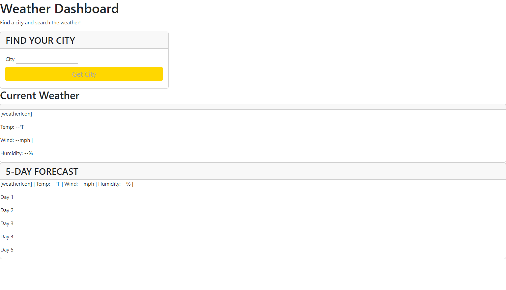

# WeatherDashboard
Weather dashboard generated with 3rd party API 

## Description
My motivation for this project was to test my new skills in 3rd party APIs. This solved the problem of where to look for the current weather. I learned that APIs don't always work the way they should. 

## Installation
None 

## Usage

Usage is available on the website. You can click all links to take you to different pages, and clicking the photos will take you to different websites. 

[link to Weather Dashboard]( https://cmeinsig.github.io/WeatherDashboard/)

## Credits

None 

## License

None